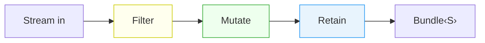
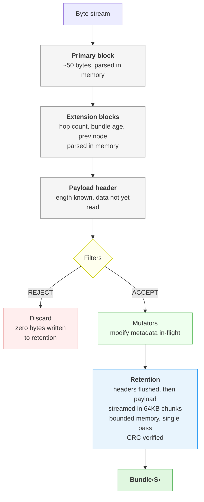
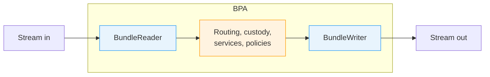

<h1 align="center">Aqueduct</h1>

<p align="center">
    <em>A high-throughput BPv7 bundle protocol library for Rust.</em>
</p>
<p align="center">
    
    
    
</p>

---

## Overview

**Aqueduct** is a Rust library for [RFC 9171](https://www.rfc-editor.org/rfc/rfc9171.html) Bundle Protocol Version 7. It targets delay-tolerant networks where bundles traverse multiple hops, can reach gigabytes in size, and must never be lost.

The name reflects the architecture: an aqueduct moves massive volumes over long distances through fixed infrastructure, without holding the water in place. Aqueduct does the same with bundles -- payloads stream from ingress to durable storage in a single pass, in bounded memory, without intermediate buffering.

> Implements [RFC 9171 - Bundle Protocol Version 7](https://www.rfc-editor.org/rfc/rfc9171.html) and [RFC 9758 - Update to the IPN URI Scheme](https://www.rfc-editor.org/rfc/rfc9758.html).

### Foundations

Aqueduct is built on four design constraints:

- **Store-carry-and-forward.** Bundle Protocol is custody-based. A bundle entering a node must be persisted before anything else. If the node crashes before forwarding, the bundle survives. Durable storage is the first operation on the reception path.
- **Stream-first I/O.** Bundles can be gigabytes. Holding a payload in contiguous memory is not an option. All parsing, filtering, and storage operates on `Read`/`AsyncRead` byte streams. A 5 GB bundle has the same memory footprint as a 50-byte one.
- **In-flight filtering.** Receiving a multi-gigabyte payload only to reject it on a policy check is not acceptable. Filters execute on the stream as each block is parsed. When the last filter passes, retention begins. Rejected bundles produce zero storage I/O.
- **Zero-allocation hot path.** CRC verification uses incremental hashing over the existing buffer with no copies. Encoder buffers are pre-sized. When no filters are configured, the reader bypasses the deferred retention path entirely.

---

## Core Concepts

**`Bundle<S>`** holds parsed metadata in memory and a reference to its retention backend. It is pure data -- no I/O methods. Readers and builders are the factories.

**`Retention`** abstracts durable storage for payload bytes (memory, disk, S3). Bytes are written during reception via `Write` and read back for forwarding. `discard()` rolls back on parse failure. Disk retention calls `fsync` on flush. S3 retention completes the multipart upload.

**`BundleReader` / `BundleAsyncReader`** parse bundles from a byte stream. They accept a `Retention` backend and an optional filter/mutator pipeline. Without filters, bytes tee directly to retention from byte 0. With filters, headers are parsed in memory first; retention activates only after all filters pass.

**`BundleFilter` / `BundleMutator`** are traits for read-only policy checks and in-flight modifications. Filters receive `BundleMetadata` (primary block, extensions, payload length) and return accept or reject. Mutators modify the primary block or extension blocks before the payload streams to storage.

## Quick Start

```rust
use aqueduct::{BundleBuilder, BundleReader, Eid, MemoryRetention};

let bundle = BundleBuilder::new(
    Eid::Ipn { allocator_id: 0, node_number: 1, service_number: 1 },
    Eid::Null,
    3_600_000,
    b"hello DTN",
    MemoryRetention::new(),
)
.unwrap()
.request_ack()
.build()
.unwrap();

let mut wire = Vec::new();
bundle.encode_to(&mut wire).unwrap();

let decoded = BundleReader::new()
    .read_from(wire.as_slice(), MemoryRetention::new())
    .unwrap();

assert_eq!(decoded.primary().dest_eid, bundle.primary().dest_eid);
```

## Filtering and Mutation

Policies are configured on the reader. Every bundle parsed through it follows the same rules.

```rust
use aqueduct::BundleReader;
use aqueduct::filter::builtin::*;

let reader = BundleReader::new()
    .filter(MaxPayloadSizeFilter::new(1_000_000_000))
    .filter(HopCountFilter)
    .mutator(HopCountIncrementMutator::new(30))
    .mutator(PreviousNodeMutator::new(local_eid));

let bundle = reader.read_from(source, retention)?;
```

Filters run in order; first rejection stops processing. Mutators run on accepted bundles before the payload streams to retention.

## Retention Backends

| Backend | Trait | Description |
|---|---|---|
| `MemoryRetention` | `Retention` | `Vec<u8>`-backed, for tests and small bundles |
| `DiskRetention` | `Retention` | File-backed, 512KB buffered I/O, `fsync` on flush |
| `S3Retention` | `AsyncRetention` | Multipart upload for large payloads, single `PUT` for small |

```rust
let disk = DiskRetention::new("/var/bundles/incoming.bin")?;

let s3 = S3Retention::new(s3_client, "bucket", "bundles/1234");
```

Implement `Retention` (sync) or `AsyncRetention` (async) for custom backends.

## Async

Enable the `async` feature for async CLA I/O and S3 storage:

```toml
[dependencies]
aqueduct = { version = "0.1", features = ["async"] }
```

```rust
use aqueduct::{BundleAsyncReader, S3Retention};

let reader = BundleAsyncReader::new()
    .filter(HopCountFilter)
    .mutator(HopCountIncrementMutator::new(30));

let bundle = reader.read_from(cla_socket, s3_retention).await?;

let mut payload = Vec::new();
bundle.async_payload_reader().await?.read_to_end(&mut payload)?;

bundle.async_encode_to(outbound_socket).await?;
```

## Architecture

**BundleReader** — stream in → Bundle



**Under the hood** — how bytes flow through the reader



**BundleWriter** — Bundle → stream out


**Inside a BPA** — Aqueduct sits at the gates




## Performance

Measured against local MinIO (S3-compatible), `--release`:

| Operation | 100 MB | 500 MB |
|---|---|---|
| Encode (memory) | 494 MB/s | 1,001 MB/s |
| Receive to S3 | 48 MB/s | 118 MB/s |
| Read from S3 | 280 MB/s | 226 MB/s |
| Forward from S3 | 295 MB/s | 154 MB/s |
| Small bundles | 429/s @ 50 concurrent | |

## RFC Compliance

- [RFC 9171](https://www.rfc-editor.org/rfc/rfc9171.html) -- Bundle Protocol Version 7
- [RFC 9758](https://www.rfc-editor.org/rfc/rfc9758.html) -- Update to the IPN URI Scheme (3-component IPN)
- CRC-16 (X-25/IBM-SDLC) and CRC-32C (Castagnoli) with incremental streaming verification
- Extension blocks: Bundle Age (type 7), Hop Count (type 10), Previous Node (type 6)

## License

See LICENSE file.
