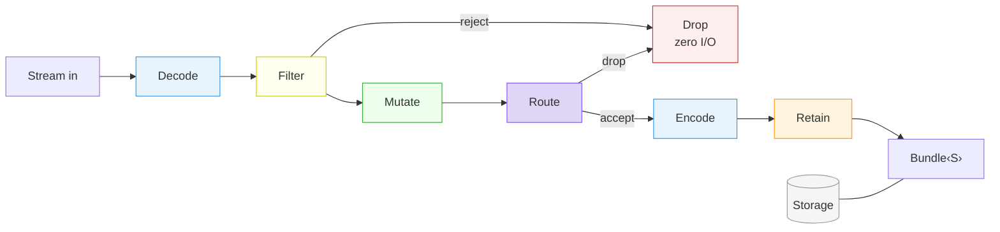
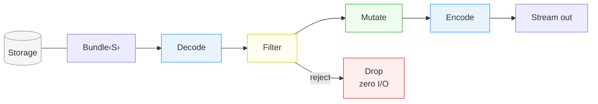
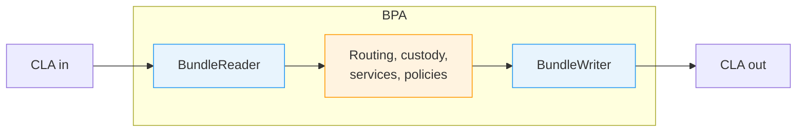

<h1 align="center">Bundle</h1>

    <em>A streaming BPv7 implementation for Rust. <code>no_std</code> compatible.</em>

    
    
    

---

## Overview

**Bundle** is a streaming [RFC 9171](https://www.rfc-editor.org/rfc/rfc9171.html) Bundle Protocol Version 7 implementation for Rust. It provides three operations: **create** a bundle, **receive** one from a byte stream, and **send** one to a byte stream.

On the receive and send paths, **filters** and **mutators** run on the bundle headers before the payload streams through. Filters accept or reject. Mutators modify blocks in-flight. On the receive path, plug your **RIB** to make routing decisions on headers alone (not implemented yet). A rejected or dropped bundle never touches storage. Use the built-in filters and mutators or implement the traits for your own.

The whole bundle is stored in a pluggable storage backend called **Retention** (memory, disk, S3, flash, or your own via a trait). Both sync and async paths are supported.

> Implements [RFC 9171 - Bundle Protocol Version 7](https://www.rfc-editor.org/rfc/rfc9171.html) and [RFC 9758 - Update to the IPN URI Scheme](https://www.rfc-editor.org/rfc/rfc9758.html).

### Foundations

The **Bundle** lib is built on four design constraints:

- **Store-carry-and-forward.** A bundle must be persisted before anything else. Durable storage is the first operation on the reception path.
- **RFC 9171 idiomatic.** Headers come first on the wire. Filtering, mutation, and RIB lookup run from the first bytes received.
- **Stream-first I/O.** A 5 GB bundle has the same memory footprint as a 50-byte one.
- **In-flight decisions.** Rejected by a filter or dropped by the RIB, zero storage I/O.
- **Hot path first.** Incremental CRC hashing, pre-sized buffers. Without filters, bytes stream directly to retention from byte 0.

---

## Architecture

**BundleReader** -- stream in -> Bundle

The diagram is not a sequential pipeline. Bytes are decoded continuously as they arrive. Each step triggers as soon as it has the blocks it needs:

- **Filters and mutators** run once their required blocks have been decoded (primary block, extension blocks). The fewer blocks a filter inspects, the earlier it runs.
- **RIB lookup** only needs the primary block. Without filters or mutators, routing runs as soon as the primary block arrives.
- **Retain** starts streaming the whole bundle to storage as soon as the final decision (filter + route) is made. Since nothing has been written yet, the mutated headers are encoded into the stream. Storage always holds the mutated version. The payload streams through in a single pass without buffering.

**BundleWriter** -- Bundle -> stream out

Same mechanism as BundleReader, reversed. Headers are decoded from storage, filters run, mutators modify blocks, then the mutated bundle is encoded and streamed to the wire. The payload flows directly from storage through the encoder without buffering.

## Relation with a BPA

The **Bundle** lib is not a BPA. It is the protocol layer a BPA is built on. The BPA provides transport (CLAs), routing, custody, and application services. The **Bundle** lib handles the wire format, filtering, mutation, and storage.

---

## RFC Compliance

- [RFC 9171](https://www.rfc-editor.org/rfc/rfc9171.html) -- Bundle Protocol Version 7
- [RFC 9758](https://www.rfc-editor.org/rfc/rfc9758.html) -- Update to the IPN URI Scheme (3-component IPN)
- CRC-16 (X-25/IBM-SDLC) and CRC-32C (Castagnoli) with incremental streaming verification
- Extension blocks: Bundle Age (type 7), Hop Count (type 10), Previous Node (type 6)

